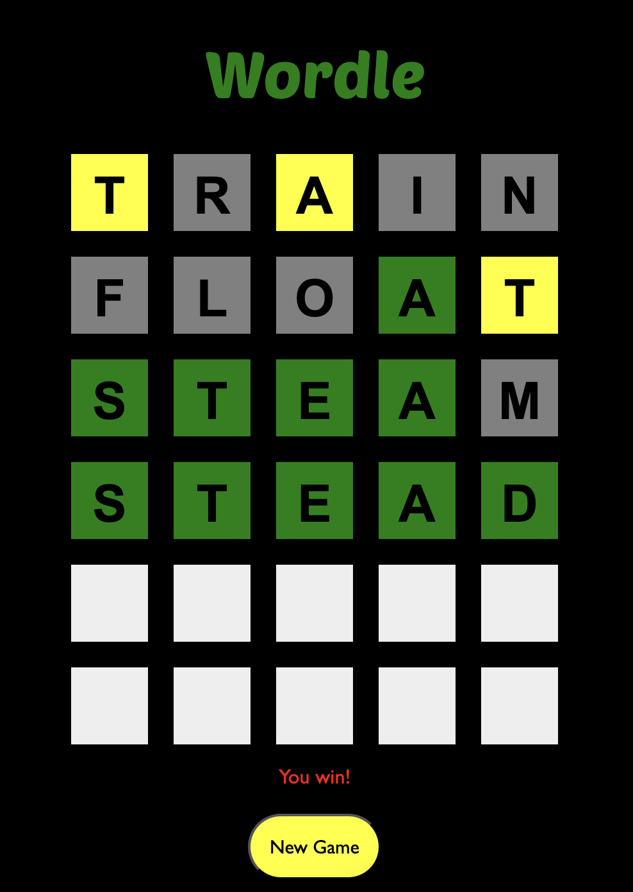
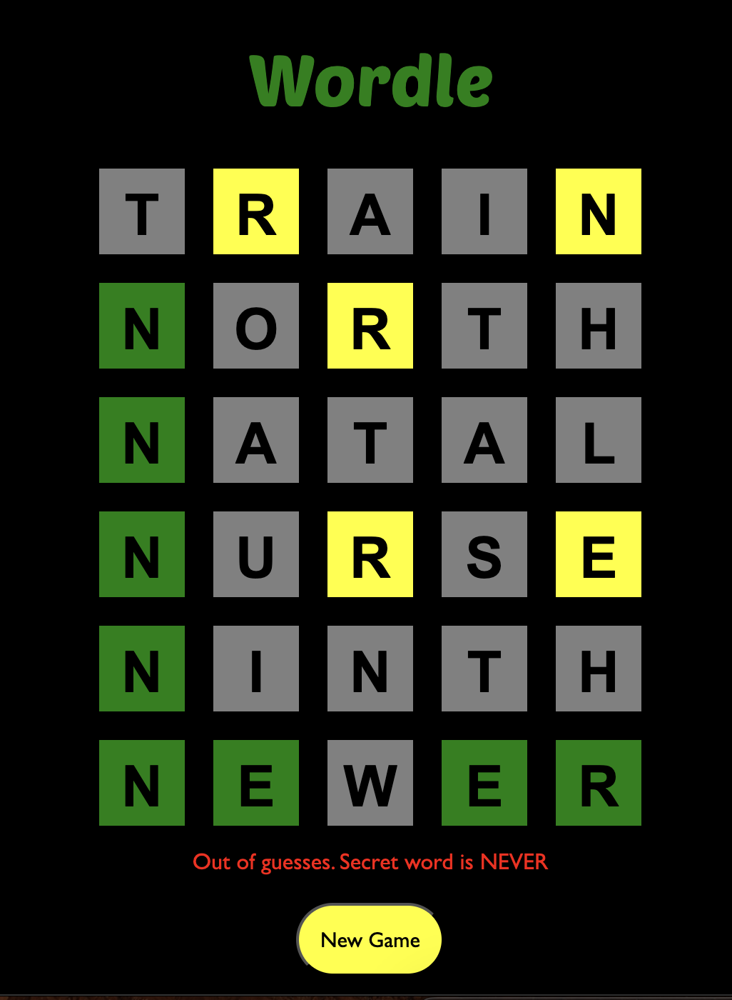

# Wordle

A Javascript implementation of the popular word puzzle game.

## Description
This project is a simple clone of the Wordle game. The player has six attempts to guess a secret five-letter word. After each guess, the letters are marked with different colors to indicate correct letters and their positions relative to the secret word.

## Getting Started
Deployed game: https://molliean.github.io/project-wordle/

- Use your keyboard directly to input guesses. 

- Press `enter` to submit a guess.  

- Click `New Game` to start over.

## Features

- Randomly generated secret word from a predefined list.
- Interactive UI with CSS Grid.
- Visual feedback for each guess (correct letters and positions).
- Alerts for invalid words and win/loss conditions.
- Reset functionality to start a new game.

## Code Overview

### HTML

The `index.html` file contains the structure of the game, including the game board and the "New Game" button.

### CSS

The `style.css` file contains the styles for the game, including the layout and visual feedback for the guesses.

### JavaScript

The `app.js` file contains the game logic, including:

- **Initialization**: Setting up the game with a random secret word.
- **Event Handling**: Capturing user input and updating the game state.
- **Rendering**: Updating the UI based on the game state.
- **Game Logic**: Checking guesses, providing feedback, and handling win/loss conditions.

### Key Functions

- `getRandomWord()`: Selects a random word from the predefined list.
- `handleKeyPress(e)`: Handles user input from the keyboard.
- `renderTile(rowIndex, colIndex, letter)`: Updates the content of a tile in the UI.
- `submitGuess()`: Processes the player's guess and updates the game state.
- `processGuess(guess)`: Determines the feedback for a guess.
- `updateColors(feedback)`: Applies color feedback to the tiles.
- `resetGame()`: Resets the game state for a new game.

## Next Steps
Additional features to enhance the game include:

- Adding a timer to show time elapsed in the game.
- Adding an instructions box to toggle into.
- Enable playing on mobile.
